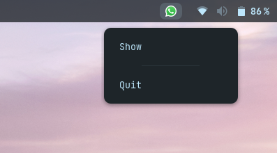
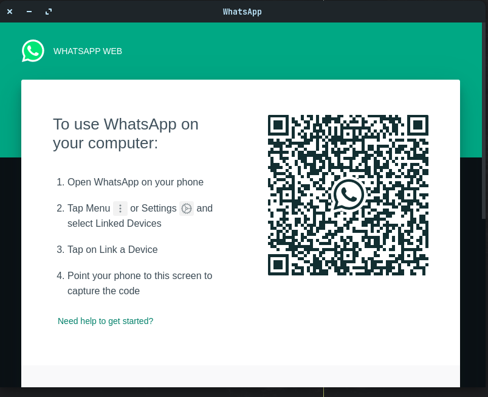

# About
A simple application in electron that lets you run whatsapp with a system tray.

# How to use
1 - Clone this project

2 - Install dependencies with `npm ci` or `npm i`

3 - To develop run `npm start`

4 - To build run `npm dist`

Developed with 🖤 for [Vinicius Mazon](https://github.com/ViniciusMazon)
